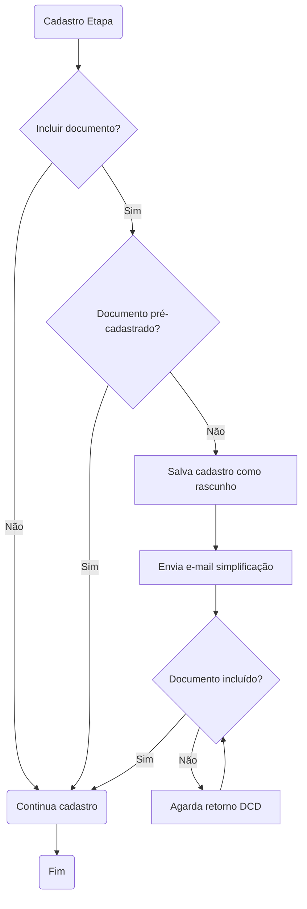
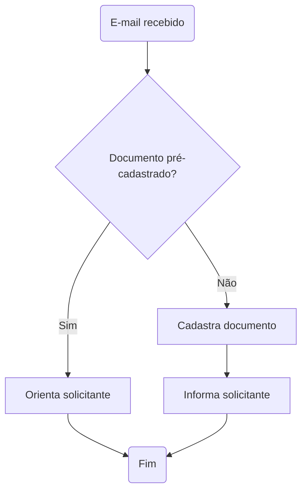

# Acompanhamento açõs fluxo de cadastro outros documentos

- **Data:** 29/09/2023

## Pauta
- Acompanhamento ações do projeto:
    - Alinhamentos Cora:
        - Capacidade de rodadas de revisão com 20 serviços.
        - Iniciaremos a primeira rodada na próxima semana.
        - [Planilha preparada para o trabalho](https://cecad365.sharepoint.com/:x:/s/SCCA-DCAE-Canaiseletrnicos/ESNLHigw6WVJq1DG2Bucl38B20w4nSn5JSK4qV7l2GJ-OQ?e=97eBG9). Nova aba permitirá atualizarmos o relatório posteriormente sem perdermos os dados cadastrados durante a análise.
  - Retirar botão "outros documentos" (Bruno).
  - Pensar novo texto de orientação (Gabriel).
  - Desenhar o fluxo completo (Gabriel).
  - Pensar campos que hoje não aparecem para o cidadão (Gabriel).
  - Criar acessos Portal MG para equipe DCD (Inclusive ambiente de homologação) (Bruno).

## Participantes
- Gabriel
- Bruno
- Leyde

## Assuntos tratados
- Gabriel apresentou fluxo desenhado:

- Novo fluxo análise cadastro documento

- Bruno e Leyde gostaram da [Planilha preparada para o trabalho](https://cecad365.sharepoint.com/:x:/s/SCCA-DCAE-Canaiseletrnicos/ESNLHigw6WVJq1DG2Bucl38B20w4nSn5JSK4qV7l2GJ-OQ?e=97eBG9).
- Bruno reforçou no fluxo a necessidade da análise se o documento já está cadastrado e das orientações que daremos aos órgãos neste sentido.
- Bruno reforçou no fluxo a necessidade da análise da linguagem simples para os serviços e etapas cadastradas.
- Bruno informou que retirada do botão "Outros documentos já está no backlog e irá conferir na próxima segunda se será possível incluir na sprint corrente.
- Gabriel [enviou informações necessárias](https://github.com/suges-mg/handbook/issues/36) para cadastro painel Admin Portal MG (inclusive ambiente de homologação).
- Leyde enviou lista de órgãos que já foram capacitados:

| Hemominas e ARSAE          | 24/out     |
|----------------------------|------------|
| SEF e JUCEMG               | 10/nov     |
| SEE, CEE, UEMG e UNIMONTES | 28/nov     |
| Detran, PCMMG, DER         | 30/nov     |
| Semad, IEF, Igam, Sisema   | 09/dez     |
| Seinfra/Faop               | 12/dez     |
| Segov/Sede                 | 13/dez     |
| Scult/Codemge/Cemig/Segov  | 12/09/2023 |

- Para estes listados acima faremos uma capacitação a parte.
- Leyde irá encaminhar na Segunda-feira cartilha da capacitação que que Gabriel revise a parte do novo fluxo.
- Gabriel deverá enviar texto de orientação que será incluído com retirada do botão.

## Dúvidas
- Incluir dúvidas.

## Ideias
- Incluir ideias.

## Ações
- [Revisão documento treinamento](https://github.com/lab-mg/handbook/issues/44) finalizada em 06/10/2023.
- Enviar texto de orientação (Gabriel) - [Texto enviado em 05/10/2023](https://github.com/lab-mg/handbook/issues/37#issuecomment-1750925109).
- Para próxima reunião:
    - Conferir se foi possível incluir na sprint retirada do Botão - Bruno informou em 05/10/2023 que foi incluído.
    - Conferir se acesso ao banco foi liberado - até 06/10/2023 não devido falta de ip VPN Gabriel.
