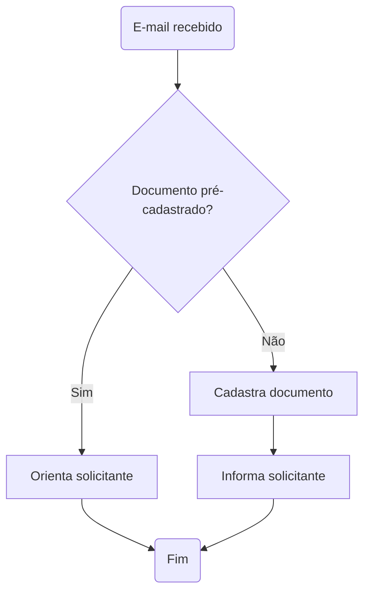

---
tags:
  - Mapa de transformação
---

# Acompanhamento açõs fluxo de cadastro outros documentos

**Data:** 29/09/2023

## Pauta
- Acompanhamento ações do projeto:
    - Alinhamentos Cora:
        - Capacidade de rodadas de revisão com 20 serviços.
        - Iniciaremos a primeira rodada na próxima semana.
        - [Planilha preparada para o trabalho](https://cecad365.sharepoint.com/:x:/s/SCCA-DCAE-Canaiseletrnicos/ESNLHigw6WVJq1DG2Bucl38B20w4nSn5JSK4qV7l2GJ-OQ?e=97eBG9). Nova aba permitirá atualizarmos o relatório posteriormente sem perdermos os dados cadastrados durante a análise.
  - Retirar botão "outros documentos" (Bruno).
  - Pensar novo texto de orientação (Gabriel).
  - Desenhar o fluxo completo (Gabriel).
  - Pensar campos que hoje não aparecem para o cidadão (Gabriel).
  - Criar acessos Portal MG para equipe DCD (Inclusive ambiente de homologação) (Bruno).

## Participantes
- Gabriel
- Bruno
- Polyana
- Leyde

## Assuntos tratados
- Novo fluxo cadastro documento

- Novo fluxo análise cadastro documento

## Dúvidas
- Incluir dúvidas.

## Ideias
- Incluir ideias.

## Ações
- Incluir ações.
