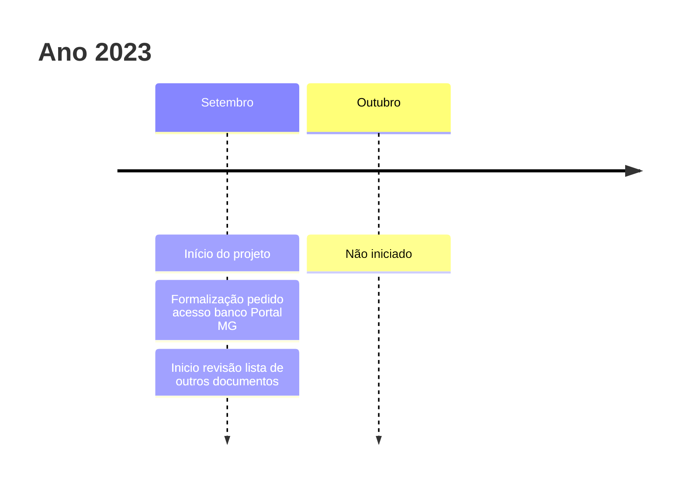
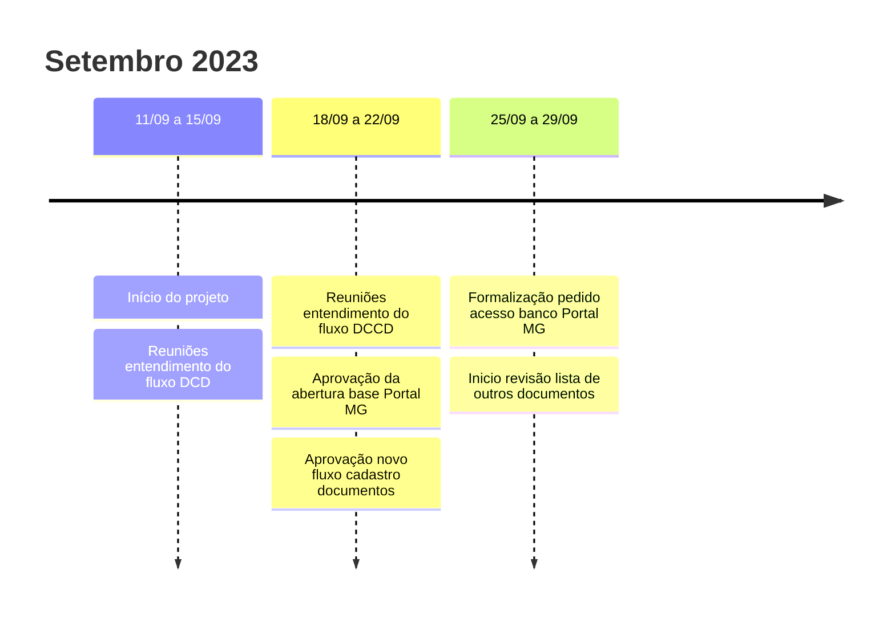

# Linha do Tempo Processo Mapa de Transformação

Ações de automatização do [Mapa de Transformação](https://app.powerbi.com/view?r=eyJrIjoiNmQzZDMxZGMtNGM0OC00YWJmLWIxMjctMTM0OWJjMTAyZWNmIiwidCI6ImU1ZDNhZTdjLTliMzgtNDhkZS1hMDg3LWY2NzM0YTI4NzU3NCJ9&pageName=ReportSection8b08997a641ffd25674f) realizadas em conjunto entre DCD e DCCD.
Visa, principalmente:

- Automatizar todo processo de ETL necessário para construção do mapa.
- Publicar em formato aberto[^1] base de dados dos serviços prestados e cadastrados no Portal MG.

Documentos relacionados ao projeto, como atas de reunião e apresentações, são organizados pela tag [Mapa de transformação](../../tags#mapa-de-transformacao).

Todas as ações desenvolvidas e planejadas podem ser acompanhadas neste [GitHub Project Board](https://github.com/orgs/suges-mg/projects/1/views/6).

## Visão Geral

# Visão Detalhada

[^1]: Exigência [§6º Art. 7º Lei 13.460](https://www.planalto.gov.br/ccivil_03/_ato2015-2018/2017/lei/l13460.htm#:~:text=%C2%A7%206%C2%BA-,Compete,-a%20cada%20ente).
